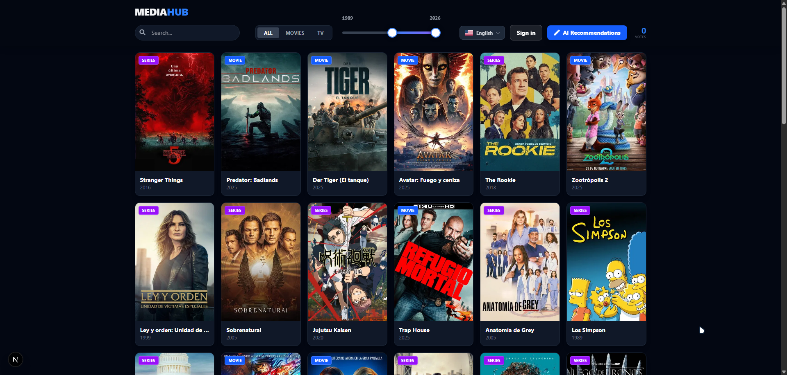
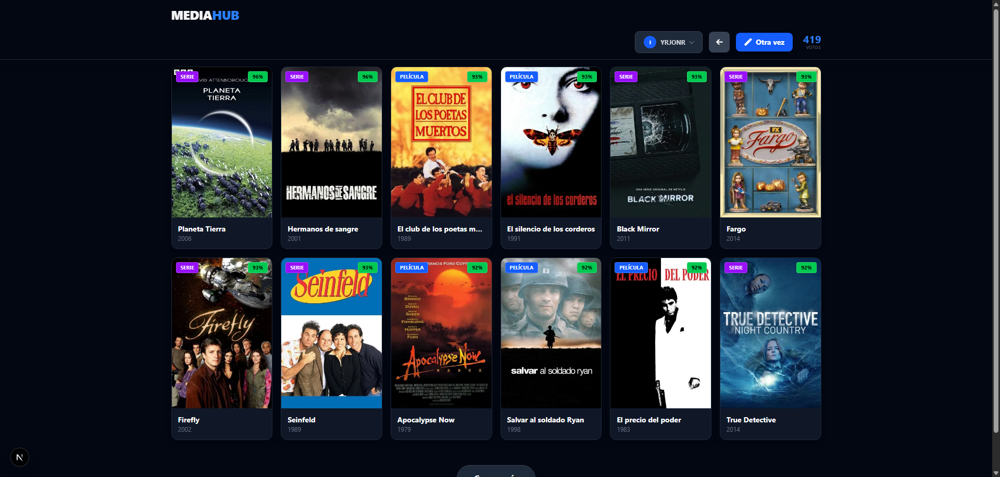
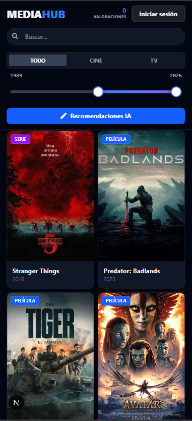

# 🎬 MEDIAHUB

> **Your intelligent cinematic companion.** Discover movies and series tailored to your unique taste using advanced AI edge computing.



[](https://nextjs.org/)
[](https://supabase.com/)
[](https://tailwindcss.com/)
[](https://www.typescriptlang.org/)

## ✨ Overview

**MediaHub AI** isn't just another movie catalog. It's a smart platform that evolves with you. By leveraging **Supabase Edge Functions** and real-time interaction data, it builds a unique taste profile for every user, delivering recommendations that feel like magic. 

Whether you are on your desktop or on the go with your mobile, MediaHub offers a seamless, app-like experience.

## 🚀 Key Features

### 🧠 AI-Powered Recommendations
Stuck on what to watch? Let our AI decide.
- **Context-Aware:** Filters recommendations based on whether you want Movies or TV Series.
- **Personalized:** Analyzes your "Likes", "SuperLikes", and even "Hates" to refine suggestions.
- **Edge Performance:** Running on Deno Edge Functions for near-instant latency.

### 📱 Mobile-First Design
A fully responsive experience that feels native.
- **Touch-Optimized:** Custom sliders, touch-friendly menus, and swipeable interfaces.
- **Adaptive Layouts:** Smart grids that adjust from ultrawide monitors to compact phone screens.
- **App-Like Feel:** Fixed headers, bottom navigation accessibility, and smooth transitions.

### ⚡ Modern Tech Stack
- **Next.js 15 (App Router):** For blazingly fast hydration and SEO.
- **Supabase Auth & DB:** Secure passwordless login ("Magic Link") and real-time database.
- **TMDB API Integration:** Access to millions of titles, high-res posters, and metadata.
- **Glassmorphism UI:** sleek dark mode aesthetic with backdrop blurs.

## 🛠️ Stack Architecture

| Component | Technology | Description |
|-----------|------------|-------------|
| **Frontend** | Next.js + React | Server Side Rendering & Client interactivity. |
| **Styling** | Tailwind CSS | Utility-first CSS for rapid UI development. |
| **Backend Logic** | Supabase Edge Functions | Serverless TypeScript functions (Deno). |
| **Database** | PostgreSQL | Robust relational data storage. |
| **External API** | TMDB | The Movie Database provider. |

## 🏗️ Getting Started

1. **Clone the repository**
   ```bash
   git clone https://github.com/IOxee/MovieHUB.git
   cd mediahub-ai
   ```

2. **Install dependencies**
   ```bash
   npm install
   ```

3. **Environment Setup**
   Create a `.env.local` file:
   ```env
   NEXT_PUBLIC_SUPABASE_URL=your_supabase_url
   NEXT_PUBLIC_SUPABASE_ANON_KEY=your_supabase_anon_key
   ```

4. **Run Development Server**
   ```bash
   npm run dev
   ```

## 📸 Snapshots

| Desktop Dashboard | AI Discovery Mode | Mobile Experience |
|-------------------|-------------------|-------------------|
|  |  |  |


# 🗺️ Roadmap
- [ ] Advanced Filtering Options (Genre, Ratings)
- [ ] User Watchlists & History
- [ ] Internacionalization (i18n)
- [ ] Dark/Light Theme Toggle


## 🤝 Contributing

Contributions are welcome! We want to make this the ultimate tool for GTAO players.

### How to contribute:
1.  **Fork the repository**.
2.  **Create a feature branch** (`git checkout -b feature/AmazingFeature`).
3.  **Commit your changes** (`git commit -m 'Add some AmazingFeature'`).
4.  **Push to the branch** (`git push origin feature/AmazingFeature`).
5.  **Open a Pull Request**.


## 📄 License

Distributed under the MIT License. See `LICENSE` for more information.

---

```text
MIT License

Copyright (c) 2025 IOxee

Permission is hereby granted, free of charge, to any person obtaining a copy
of this software and associated documentation files (the "Software"), to deal
in the Software without restriction, including without limitation the rights
to use, copy, modify, merge, publish, distribute, sublicense, and/or sell
copies of the Software, and to permit persons to whom the Software is
furnished to do so, subject to the following conditions:

The above copyright notice and this permission notice shall be included in all
copies or substantial portions of the Software.

THE SOFTWARE IS PROVIDED "AS IS", WITHOUT WARRANTY OF ANY KIND, EXPRESS OR
IMPLIED, INCLUDING BUT NOT LIMITED TO THE WARRANTIES OF MERCHANTABILITY,
FITNESS FOR A PARTICULAR PURPOSE AND NONINFRINGEMENT. IN NO EVENT SHALL THE
AUTHORS OR COPYRIGHT HOLDERS BE LIABLE FOR ANY CLAIM, DAMAGES OR OTHER
LIABILITY, WHETHER IN AN ACTION OF CONTRACT, TORT OR OTHERWISE, ARISING FROM,
OUT OF OR IN CONNECTION WITH THE SOFTWARE OR THE USE OR OTHER DEALINGS IN THE
SOFTWARE.
```
