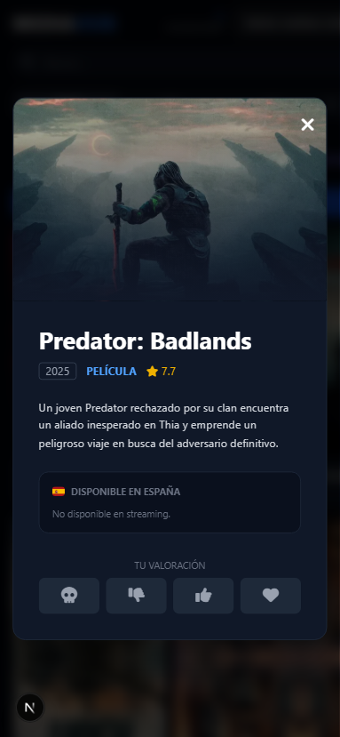
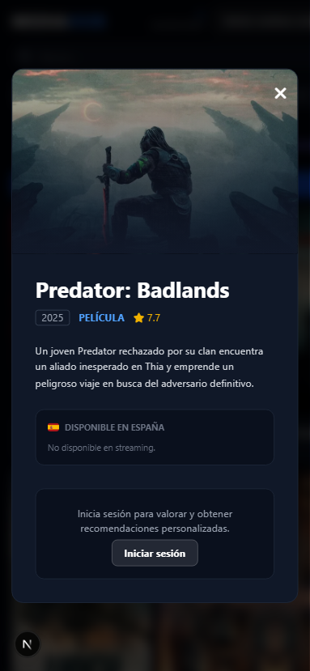
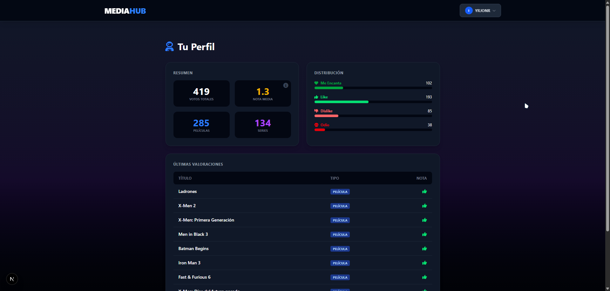

# Manual de Usuario - MediaHub

Este documento sirve como guía visual para el uso de la aplicación MediaHub, destacando sus capacidades de adaptación móvil y sistema de recomendaciones inteligente.

## 1. Vista Principal (Escritorio)
La pantalla de inicio ofrece un acceso rápido a todo el catálogo de películas y series.

**Captura sugerida:** Vista completa de la web en escritorio mostrando el timeline, filtros y cuadrícula de carátulas.

### Funcionalidades:
- **Filtros de Contenido:** Alterna entre "Todo", "Películas" y "Series".
- **Línea de Tiempo:** Deslizador doble para filtrar contenido por año (1970 - 2026).
- **Buscador Instantáneo:** Búsqueda en tiempo real por título.

---

## 2. Adaptación Móvil
La aplicación está totalmente optimizada para dispositivos móviles, con una interfaz táctil amigable.

**Captura sugerida:** Vista en modo inspección móvil (iPhone/Android).

### Mejoras Móviles:
- **Cabecera Compacta:** Elementos reorganizados para fácil alcance del pulgar.
- **Menú de Usuario Táctil:** Botón de perfil que responde al toque (tap) en lugar de hover.
- **Sliders Ajustados:** Controles de línea de tiempo con mayor área de contacto.

---

## 3. Sistema de Recomendaciones (IA)
El corazón de MediaHub. Al pulsar el botón "IA" (o varita mágica), la interfaz se transforma para mostrar contenido sugerido basado en tus gustos.

**Captura sugerida:** Pantalla con la interfaz de recomendaciones activa (sin barra de búsqueda ni timeline).

### Características del Modo IA:
- **Interfaz Limpia:** Se ocultan la barra de búsqueda y el timeline para evitar distracciones.
- **Navegación Contextual:**
  - Botón **"Otra vez"**: Genera nuevas recomendaciones instantáneamente.
  - Botón **"Volver al Catálogo"**: Regresa a la vista normal conservando tus filtros.
- **Filtros Inteligentes:** Si cambias de "Cine" a "TV" estando en este modo, la IA recalcula las recomendaciones automáticamente para ese medio.

---

## 4. Detalles y Votación
Al hacer clic en cualquier carátula se abre una ficha detallada.

**Captura sugerida:** Modal abierto de una película.

### Sistema de Votos:
- **Usuarios Registrados:** Pueden votar con "Odio", "Dislike", "Like" o "SuperLike". Estas valoraciones alimentan el algoritmo de IA.
- **Usuarios Invitados:** Ven un mensaje invitándoles a iniciar sesión, sin mostrar porcentajes de afinidad irrelevantes.

---

## 5. Perfil de Usuario
Tu espacio personal con estadísticas de consumo.

**Captura sugerida:** Página de perfil con gráficos y tablas.

- **Distribución de Votos:** Gráficos de barras con tus preferencias.
- **Historial:** Tabla con tus últimas interacciones.
